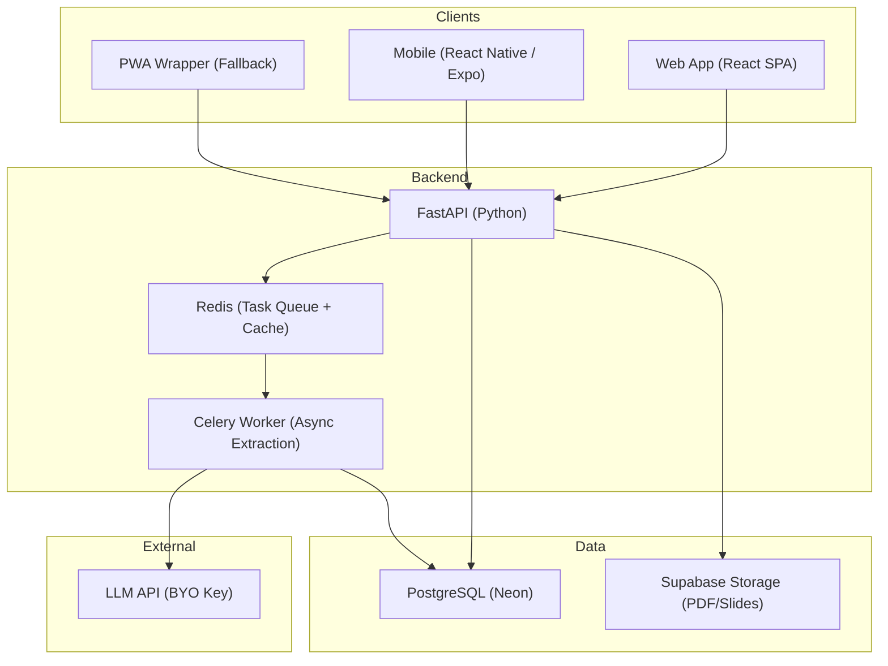
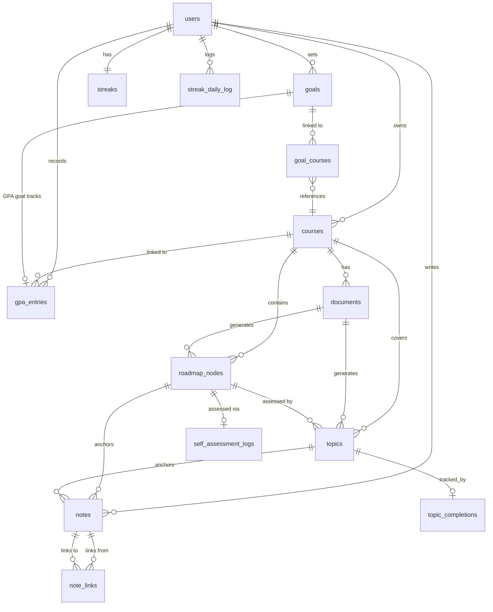
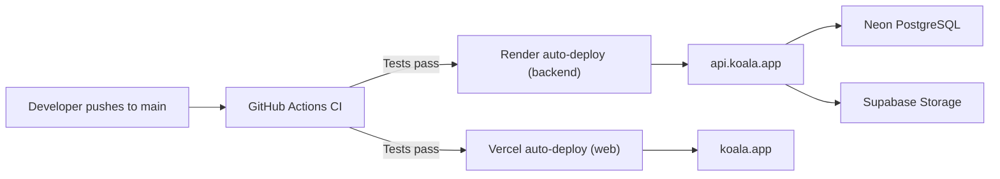
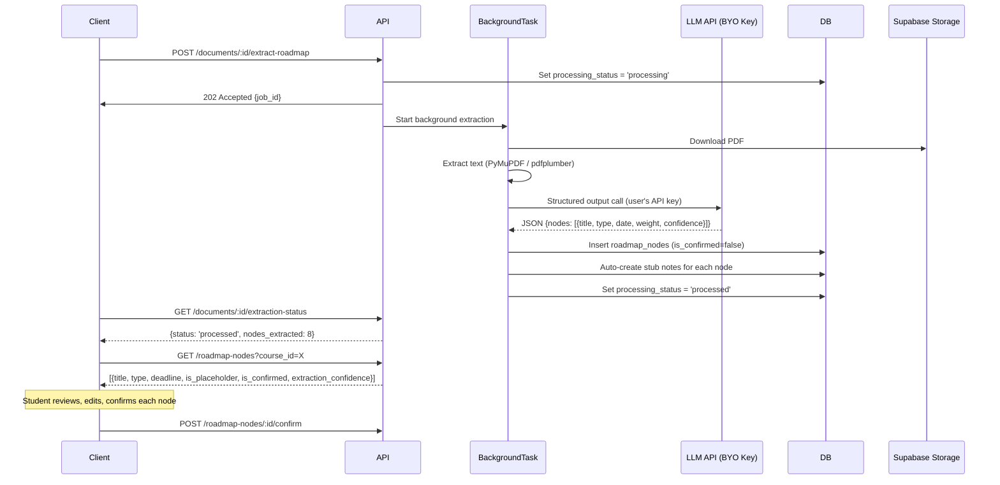
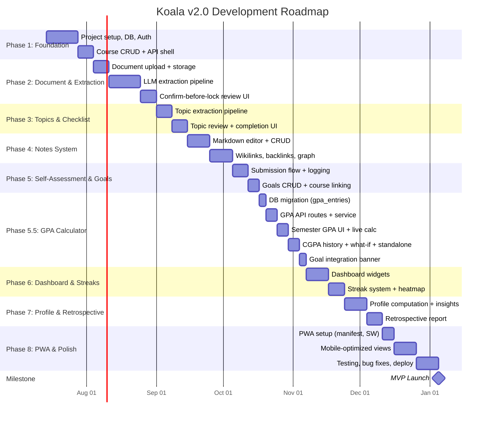

# Koala v2.0 — Comprehensive Project Plan

> From SRS to Launch: Architecture, Database, Deployment, Hosting & Roadmap
> Target: ~50 initial users | Budget: Free / as cheap as possible | Startup mindset

---

## Executive Summary

This plan transforms the [Koala SRS v2.0](file:///d:/Document/Study App/Koala_SRS_v2_0.md) into an actionable, phased roadmap. It covers every decision from tech stack to deployment, with **options presented where ambiguity exists** and a clear recommended path for a solo-developer, zero-budget startup.

---

## 1. Architecture Overview



---

## 2. Tech Stack Decisions

### 2.1 Backend Framework

> [!IMPORTANT]
> **Decision Required:** The SRS specifies Flask, but FastAPI is the stronger choice for a 2026 greenfield project. Your call.

| Criteria | Flask (SRS Spec) | FastAPI (Recommended) |
|---|---|---|
| **Async support** | Retrofitted (WSGI) | Native (ASGI) — critical for LLM API calls & extraction jobs |
| **Auto API docs** | Manual (Flask-RESTx) | Built-in Swagger + ReDoc |
| **Data validation** | Requires Marshmallow | Built-in Pydantic v2 |
| **Type safety** | Optional | Enforced via type hints |
| **Learning curve** | Slightly easier | Slightly steeper but well-documented |
| **Ecosystem** | Mature (16+ years) | Rapidly growing, modern |

**Recommendation: FastAPI.** The extraction pipeline makes multiple async LLM API calls — FastAPI handles this natively. Pydantic replaces Marshmallow for schemas, and you get free Swagger docs. If you're more comfortable with Flask, it will absolutely work — it just requires more boilerplate.

---

### 2.2 Web Frontend

> [!IMPORTANT]
> **Decision Required:** The SRS specifies vanilla HTML/CSS/JS. A React SPA is better suited for the note graph view, real-time dashboard, and extraction review UI.

| Criteria | Vanilla HTML/CSS/JS (SRS Spec) | React + Vite (Recommended) |
|---|---|---|
| **Complexity match** | Adequate for CRUD, struggles with graph view & rich markdown editor | Built for interactive UIs, component reuse |
| **Code sharing with mobile** | None | Shared API layer, types, and utilities with React Native |
| **Markdown editor** | Must build from scratch | Libraries: react-markdown, TipTap, Milkdown |
| **Graph visualization** | D3.js (works either way) | react-force-graph or Cytoscape.js wrappers |
| **Hosting cost** | Same (static files) | Same (static files — Vercel/Netlify free tier) |
| **Build complexity** | None | Vite (fast, minimal config) |

**Recommendation: React (Vite).** The note system with wikilinks, backlinks, graph view, and the extraction confirm-before-lock review UI are highly interactive components that would be painful in vanilla JS. React also shares mental models with React Native.

**Alternative (if you want to stay close to SRS):** Vanilla HTML/JS + HTMX for interactivity. Simpler, no build step, but harder to build the graph view and markdown editor.

---

### 2.3 Mobile Strategy

> [!IMPORTANT]
> **Decision Required:** This is the biggest cost/effort tradeoff in the project.

| Option | Cost | Effort | UX Quality | Push Notifications |
|---|---|---|---|---|
| **Option A: React Native (Expo)** | $25 Google Play (one-time) + $99/yr Apple | High (separate codebase, but shares API layer with React web) | Native feel | Yes (Expo Notifications — free) |
| **Option B: PWA (Recommended for MVP)** | $0 | Low (same React web codebase, responsive) | Good (installable, works offline for quick-capture) | Limited (Web Push — works on Android, limited iOS) |
| **Option C: PWA first → React Native later** | $0 now, $124+ later | Phased | Good → Native | Limited → Full |

**Recommendation: Option C (PWA first, React Native later).**

Rationale:
- With ~50 users, you don't need native app store presence yet
- A PWA saves $99/yr (Apple) and eliminates the iOS build complexity (requires a Mac)
- PWA covers 90% of the mobile use cases: daily logging, topic check-offs, quick-capture
- The one gap is **push notifications on iOS** — work around this with email nudges initially
- When you hit ~200+ users and want native push on iOS → build the React Native app
- The React web + PWA codebase directly informs the React Native version (shared patterns, API client, state logic)

> [!WARNING]
> If push notifications on iOS are non-negotiable from day one, go with **Option A: React Native (Expo)** immediately. This adds ~4-6 weeks to the timeline and requires access to a Mac for iOS builds (or EAS Build at $0 on the free tier for limited builds).

---

### 2.4 Database

| Criteria | Neon (Recommended) | Supabase | Render |
|---|---|---|---|
| **Free storage** | 0.5 GB/project | 500 MB | 1 GB |
| **Persistence** | Permanent (scale-to-zero) | Pauses after 7 days inactive | **Expires after 30 days** |
| **Cold start** | ~2s after idle | ~5s after pause | N/A (data deleted) |
| **Branching** | Yes (great for dev/staging) | No | No |
| **Best for** | Pure database use | Full BaaS (auth, storage, DB) | Short-term demos only |

**Recommendation: Neon for database.**

For 50 users with ~1,000 nodes/notes each, the 0.5 GB free tier is sufficient. Neon's scale-to-zero is ideal for a low-traffic startup — you only pay compute when active, and the free tier includes 100 CU-hours/month (enough for ~50 users).

> [!NOTE]
> **Growth path:** When you exceed the free tier (~200+ users or heavy extraction), Neon's paid plans start at $19/mo — much cheaper than running your own Postgres.

---

### 2.5 File Storage (PDFs, Slides)

| Option | Free Tier | Egress | Integration |
|---|---|---|---|
| **Supabase Storage (Recommended)** | 1 GB | 2 GB/mo | Direct upload via signed URLs, good SDKs |
| **Cloudflare R2** | 10 GB | Free egress | S3-compatible, no SDK — more DIY |
| **Backblaze B2** | 10 GB | 1 GB free/day | S3-compatible, cheapest at scale |

**Recommendation: Supabase Storage.** Even though we use Neon for the database, Supabase's free project gives us 1 GB file storage with signed URL uploads (PDFs never touch your Flask/FastAPI server). For 50 users uploading ~5 syllabi each at ~2 MB average = ~500 MB — fits in the free tier.

**How it works:**
1. Client requests a signed upload URL from your API
2. Client uploads PDF directly to Supabase Storage
3. API stores the file path in the database
4. Extraction worker downloads the file from Supabase to process it

---

### 2.6 Task Queue (Async Extraction)

| Option | Free? | Complexity | Notes |
|---|---|---|---|
| **Celery + Redis** | Yes (if self-hosted Redis) | Medium | Industry standard, battle-tested |
| **FastAPI BackgroundTasks** | Yes | Low | Good for simple tasks, no retry/monitoring |
| **Dramatiq + Redis** | Yes | Medium | Simpler API than Celery |
| **Upstash Redis (serverless)** | Free tier: 10K commands/day | Low | No self-hosting, works with Celery |

**Recommendation: FastAPI `BackgroundTasks` for MVP, migrate to Celery + Upstash Redis when needed.**

For 50 users doing ~2-3 extractions per semester, `BackgroundTasks` handles the load. You won't need Celery's retries and monitoring until you have concurrent extraction jobs. When you do:
- **Upstash Redis** free tier (10K commands/day) is perfect as the Celery broker
- No need to self-host Redis

---

### 2.7 Backend Hosting

| Platform | Free Tier | Cold Start | Deployment | Best For |
|---|---|---|---|---|
| **Render (Recommended)** | Yes (spin-down after 15 min) | ~60s | Git push | Simplicity |
| **Railway** | $5 trial credits only | None (always on) | Git push | DX quality |
| **Fly.io** | Credit-based, no real free tier | None | Docker | Global edge |
| **Koyeb** | 1 free nano service | ~15s | Git/Docker | Alternative to Render |

**Recommendation: Render free tier for MVP.**

The cold start (~60s on first request after 15 min idle) is acceptable for 50 users — after the first hit, it stays warm. For a startup with near-zero traffic at launch, this is the pragmatic choice.

**Growth path:** When cold starts annoy users (~100+ DAU), upgrade to Render's paid tier ($7/mo for always-on) or migrate to Railway ($5/mo hobby plan).

---

### 2.8 Web Frontend Hosting

| Platform | Free Tier | Build | Custom Domain | SSL |
|---|---|---|---|---|
| **Vercel (Recommended)** | Unlimited for hobby | Auto (Vite) | Yes | Yes |
| **Netlify** | 100 GB bandwidth/mo | Auto | Yes | Yes |
| **Cloudflare Pages** | Unlimited bandwidth | Auto | Yes | Yes |

**Recommendation: Vercel.** Optimized for React/Vite, instant deploys on git push, free SSL, custom domain. Zero config.

---

## 3. Database Design

### 3.1 Entity-Relationship Diagram



### 3.2 Schema (Full DDL)

The schema below follows the SRS (Section 5) with these **enhancements** for production readiness:

```sql
-- ============================================
-- Koala v2.0 — PostgreSQL Schema
-- ============================================

-- Enable UUID extension (optional, for future API-facing IDs)
-- CREATE EXTENSION IF NOT EXISTS "uuid-ossp";

-- =====================
-- 1. USERS
-- =====================
CREATE TABLE users (
    id              SERIAL PRIMARY KEY,
    email           VARCHAR(255) UNIQUE NOT NULL,
    password_hash   VARCHAR(255) NOT NULL,           -- bcrypt, cost ≥ 12
    full_name       VARCHAR(255),
    institution     VARCHAR(255),
    plan            VARCHAR(20) NOT NULL DEFAULT 'free'
                    CHECK (plan IN ('free','pro')),   -- Current tier (FR-00-02)
    plan_expires_at TIMESTAMPTZ,                      -- NULL = no expiry (free); set on Pro activation
    created_at      TIMESTAMPTZ NOT NULL DEFAULT NOW(),
    updated_at      TIMESTAMPTZ NOT NULL DEFAULT NOW()
);

CREATE INDEX idx_users_email ON users(email);

-- =====================
-- 2. COURSES
-- =====================
CREATE TABLE courses (
    id              SERIAL PRIMARY KEY,
    user_id         INTEGER NOT NULL REFERENCES users(id) ON DELETE CASCADE,
    name            VARCHAR(255) NOT NULL,
    code            VARCHAR(50),
    semester        VARCHAR(50) NOT NULL,             -- e.g. "Fall", "Spring"
    academic_year   VARCHAR(20),                      -- e.g. "2026-2027"
    is_archived     BOOLEAN NOT NULL DEFAULT FALSE,
    credit_hours    DECIMAL(4,2),                     -- Course credit units (FR-13-04)
    grade_letter    VARCHAR(5),                       -- Final letter grade, nullable (FR-13-06)
    grade_scale     VARCHAR(10) NOT NULL DEFAULT '4.0',-- '4.0' | '5.0' | '10' (FR-13-05)
    doc_upload_count INTEGER NOT NULL DEFAULT 0,      -- Running count for upload limit enforcement (FR-00-05)
    created_at      TIMESTAMPTZ NOT NULL DEFAULT NOW(),
    updated_at      TIMESTAMPTZ NOT NULL DEFAULT NOW()
);

CREATE INDEX idx_courses_user_id ON courses(user_id);
CREATE INDEX idx_courses_semester ON courses(user_id, semester, academic_year);

-- =====================
-- UPLOAD LIMIT CONSTANTS (enforced in application layer)
-- Free:  doc_upload_count <= 3  (syllabus/CLO types only)
-- Pro:   doc_upload_count <= 20 (all doc types)
-- =====================

-- =====================
-- 3. DOCUMENTS
-- =====================
CREATE TABLE documents (
    id                  SERIAL PRIMARY KEY,
    course_id           INTEGER NOT NULL REFERENCES courses(id) ON DELETE CASCADE,
    user_id             INTEGER NOT NULL REFERENCES users(id) ON DELETE CASCADE,
    doc_type            VARCHAR(50) NOT NULL 
                        CHECK (doc_type IN ('syllabus','clo','instructor_notes','slides','academic_calendar')),
    file_name           VARCHAR(255) NOT NULL,
    storage_path        TEXT NOT NULL,                -- Supabase Storage path
    file_size_bytes     INTEGER,
    mime_type           VARCHAR(100),
    processing_status   VARCHAR(50) NOT NULL DEFAULT 'pending'
                        CHECK (processing_status IN ('pending','processing','processed','failed')),
    processed_at        TIMESTAMPTZ,
    error_message       TEXT,                         -- Store extraction failure reason
    -- Tier check: doc_type IN ('instructor_notes','slides') is Pro-only (FR-04-01)
    -- File size limit: Free ≤ 10 MB, Pro ≤ 25 MB (enforced before upload in service layer)
    created_at          TIMESTAMPTZ NOT NULL DEFAULT NOW(),
    updated_at          TIMESTAMPTZ NOT NULL DEFAULT NOW()
);

CREATE INDEX idx_documents_course_id ON documents(course_id);

-- =====================
-- 2.5 SUBSCRIPTIONS
-- Billing webhook events are written here by the billing service.
-- The users.plan column is the authoritative fast-check; this table
-- stores the full event history for audit and renewal tracking.
-- =====================
CREATE TABLE subscriptions (
    id                  SERIAL PRIMARY KEY,
    user_id             INTEGER NOT NULL REFERENCES users(id) ON DELETE CASCADE,
    provider            VARCHAR(50) NOT NULL DEFAULT 'stripe', -- 'stripe' | 'lemonsqueezy'
    provider_sub_id     VARCHAR(255) UNIQUE,          -- External subscription ID
    plan                VARCHAR(20) NOT NULL CHECK (plan IN ('free','pro')),
    status              VARCHAR(50) NOT NULL
                        CHECK (status IN ('active','cancelled','past_due','expired')),
    current_period_start TIMESTAMPTZ,
    current_period_end  TIMESTAMPTZ,
    cancelled_at        TIMESTAMPTZ,
    created_at          TIMESTAMPTZ NOT NULL DEFAULT NOW(),
    updated_at          TIMESTAMPTZ NOT NULL DEFAULT NOW()
);

CREATE INDEX idx_subscriptions_user ON subscriptions(user_id);
CREATE INDEX idx_subscriptions_provider_id ON subscriptions(provider_sub_id);

-- =====================
-- 4. ROADMAP NODES
-- =====================
CREATE TABLE roadmap_nodes (
    id                      SERIAL PRIMARY KEY,
    course_id               INTEGER NOT NULL REFERENCES courses(id) ON DELETE CASCADE,
    user_id                 INTEGER NOT NULL REFERENCES users(id) ON DELETE CASCADE,
    source_document_id      INTEGER REFERENCES documents(id) ON DELETE SET NULL,
    title                   VARCHAR(255) NOT NULL,
    node_type               VARCHAR(100) NOT NULL DEFAULT 'Other'
                            CHECK (node_type IN ('Assignment','Quiz','Exam','Project','Lab','Other')),
    deadline                TIMESTAMPTZ,              -- NULL while placeholder
    weight_percent          DECIMAL(5,2),
    is_placeholder          BOOLEAN NOT NULL DEFAULT TRUE,
    is_confirmed            BOOLEAN NOT NULL DEFAULT FALSE,
    extraction_confidence   DECIMAL(3,2),             -- 0.00 to 1.00 per-field avg
    estimated_hours         DECIMAL(5,2),
    actual_hours            DECIMAL(5,2),
    confidence_at_creation  SMALLINT CHECK (confidence_at_creation BETWEEN 1 AND 5),
    status                  VARCHAR(50) NOT NULL DEFAULT 'Pending'
                            CHECK (status IN ('Pending','In Progress','Submitted','Graded')),
    grade                   DECIMAL(5,2),
    submitted_at            TIMESTAMPTZ,
    created_at              TIMESTAMPTZ NOT NULL DEFAULT NOW(),
    updated_at              TIMESTAMPTZ NOT NULL DEFAULT NOW()
);

CREATE INDEX idx_roadmap_nodes_course_id ON roadmap_nodes(course_id);
CREATE INDEX idx_roadmap_nodes_user_id ON roadmap_nodes(user_id);
CREATE INDEX idx_roadmap_nodes_deadline ON roadmap_nodes(user_id, deadline);
CREATE INDEX idx_roadmap_nodes_status ON roadmap_nodes(user_id, status);

-- =====================
-- 5. TOPICS
-- =====================
CREATE TABLE topics (
    id                  SERIAL PRIMARY KEY,
    course_id           INTEGER NOT NULL REFERENCES courses(id) ON DELETE CASCADE,
    user_id             INTEGER NOT NULL REFERENCES users(id) ON DELETE CASCADE,
    source_document_id  INTEGER REFERENCES documents(id) ON DELETE SET NULL,
    linked_node_id      INTEGER REFERENCES roadmap_nodes(id) ON DELETE SET NULL,
    title               VARCHAR(255) NOT NULL,
    order_index         INTEGER NOT NULL DEFAULT 0,
    is_confirmed        BOOLEAN NOT NULL DEFAULT FALSE,
    created_at          TIMESTAMPTZ NOT NULL DEFAULT NOW(),
    updated_at          TIMESTAMPTZ NOT NULL DEFAULT NOW()
);

CREATE INDEX idx_topics_course_id ON topics(course_id);
CREATE INDEX idx_topics_order ON topics(course_id, order_index);

-- =====================
-- 6. TOPIC COMPLETIONS
-- =====================
CREATE TABLE topic_completions (
    id                  SERIAL PRIMARY KEY,
    topic_id            INTEGER NOT NULL REFERENCES topics(id) ON DELETE CASCADE,
    user_id             INTEGER NOT NULL REFERENCES users(id) ON DELETE CASCADE,
    is_completed        BOOLEAN NOT NULL DEFAULT FALSE,
    confidence_rating   SMALLINT CHECK (confidence_rating BETWEEN 1 AND 5),
    completed_at        TIMESTAMPTZ,
    linked_note_id      INTEGER,                      -- FK added after notes table
    created_at          TIMESTAMPTZ NOT NULL DEFAULT NOW(),
    updated_at          TIMESTAMPTZ NOT NULL DEFAULT NOW(),
    
    UNIQUE(topic_id, user_id)                         -- One completion per user per topic
);

CREATE INDEX idx_topic_completions_user ON topic_completions(user_id);

-- =====================
-- 7. NOTES
-- =====================
CREATE TABLE notes (
    id              SERIAL PRIMARY KEY,
    user_id         INTEGER NOT NULL REFERENCES users(id) ON DELETE CASCADE,
    course_id       INTEGER REFERENCES courses(id) ON DELETE SET NULL,
    roadmap_node_id INTEGER REFERENCES roadmap_nodes(id) ON DELETE SET NULL,
    topic_id        INTEGER REFERENCES topics(id) ON DELETE SET NULL,
    title           VARCHAR(255) NOT NULL,
    content         TEXT NOT NULL DEFAULT '',          -- Markdown source
    is_stub         BOOLEAN NOT NULL DEFAULT FALSE,
    is_quick_capture BOOLEAN NOT NULL DEFAULT FALSE,  -- Mobile quick-capture flag
    created_at      TIMESTAMPTZ NOT NULL DEFAULT NOW(),
    updated_at      TIMESTAMPTZ NOT NULL DEFAULT NOW()
);

-- Add FK from topic_completions to notes
ALTER TABLE topic_completions 
    ADD CONSTRAINT fk_tc_linked_note 
    FOREIGN KEY (linked_note_id) REFERENCES notes(id) ON DELETE SET NULL;

CREATE INDEX idx_notes_user_id ON notes(user_id);
CREATE INDEX idx_notes_course_id ON notes(course_id);
CREATE INDEX idx_notes_roadmap_node ON notes(roadmap_node_id);
CREATE INDEX idx_notes_topic ON notes(topic_id);
-- Full-text search index (FR-06-07)
CREATE INDEX idx_notes_fts ON notes USING gin(to_tsvector('english', title || ' ' || content));

-- =====================
-- 8. NOTE LINKS (bi-directional)
-- =====================
CREATE TABLE note_links (
    id              SERIAL PRIMARY KEY,
    source_note_id  INTEGER NOT NULL REFERENCES notes(id) ON DELETE CASCADE,
    target_note_id  INTEGER NOT NULL REFERENCES notes(id) ON DELETE CASCADE,
    created_at      TIMESTAMPTZ NOT NULL DEFAULT NOW(),
    
    UNIQUE(source_note_id, target_note_id),
    CHECK(source_note_id != target_note_id)           -- No self-links
);

CREATE INDEX idx_note_links_source ON note_links(source_note_id);
CREATE INDEX idx_note_links_target ON note_links(target_note_id);

-- =====================
-- 9. SELF-ASSESSMENT LOGS
-- =====================
CREATE TABLE self_assessment_logs (
    id                      SERIAL PRIMARY KEY,
    roadmap_node_id         INTEGER NOT NULL UNIQUE REFERENCES roadmap_nodes(id) ON DELETE CASCADE,
    user_id                 INTEGER NOT NULL REFERENCES users(id) ON DELETE CASCADE,
    quality_self_rating     SMALLINT NOT NULL CHECK (quality_self_rating BETWEEN 1 AND 5),
    mood_energy             SMALLINT CHECK (mood_energy BETWEEN 1 AND 5),
    reflection_note         TEXT,
    hours_before_deadline   DECIMAL(8,2),             -- Positive = early, negative = late
    created_at              TIMESTAMPTZ NOT NULL DEFAULT NOW(),
    updated_at              TIMESTAMPTZ NOT NULL DEFAULT NOW()
);

-- =====================
-- 10. GOALS
-- =====================
CREATE TABLE goals (
    id              SERIAL PRIMARY KEY,
    user_id         INTEGER NOT NULL REFERENCES users(id) ON DELETE CASCADE,
    title           VARCHAR(255) NOT NULL,
    description     TEXT,
    category        VARCHAR(100),
    semester        VARCHAR(50),
    target_date     DATE,
    status          VARCHAR(50) NOT NULL DEFAULT 'Active'
                    CHECK (status IN ('Active','Complete','Abandoned')),
    is_gpa_goal     BOOLEAN NOT NULL DEFAULT FALSE,   -- GPA-linked goal flag (FR-13-23)
    gpa_target      DECIMAL(4,2),                     -- Target GPA for GPA goals (FR-13-23)
    created_at      TIMESTAMPTZ NOT NULL DEFAULT NOW(),
    updated_at      TIMESTAMPTZ NOT NULL DEFAULT NOW()
);

CREATE INDEX idx_goals_user_id ON goals(user_id);
CREATE INDEX idx_goals_gpa ON goals(user_id, is_gpa_goal) WHERE is_gpa_goal = TRUE;

-- =====================
-- 11. GOAL-COURSE LINK (many-to-many, FR-08-03)
-- =====================
CREATE TABLE goal_courses (
    goal_id     INTEGER NOT NULL REFERENCES goals(id) ON DELETE CASCADE,
    course_id   INTEGER NOT NULL REFERENCES courses(id) ON DELETE CASCADE,
    PRIMARY KEY (goal_id, course_id)
);

-- =====================
-- 12. STREAKS
-- =====================
CREATE TABLE streaks (
    user_id                 INTEGER PRIMARY KEY REFERENCES users(id) ON DELETE CASCADE,
    activity_streak_count   INTEGER NOT NULL DEFAULT 0,
    on_time_streak_count    INTEGER NOT NULL DEFAULT 0,
    longest_activity_streak INTEGER NOT NULL DEFAULT 0,
    longest_on_time_streak  INTEGER NOT NULL DEFAULT 0,
    last_activity_date      DATE,
    updated_at              TIMESTAMPTZ NOT NULL DEFAULT NOW()
);

-- =====================
-- 13. STREAK DAILY LOG (heatmap data)
-- =====================
CREATE TABLE streak_daily_log (
    id          SERIAL PRIMARY KEY,
    user_id     INTEGER NOT NULL REFERENCES users(id) ON DELETE CASCADE,
    log_date    DATE NOT NULL,
    action_count INTEGER NOT NULL DEFAULT 0,
    
    UNIQUE(user_id, log_date)
);

CREATE INDEX idx_streak_log_user_date ON streak_daily_log(user_id, log_date);

-- =====================
-- 14. GPA ENTRIES (FR-13)
-- Stores per-course grade entries and historical semester aggregates.
-- Standalone calculator data is NEVER persisted.
-- =====================
CREATE TABLE gpa_entries (
    id              SERIAL PRIMARY KEY,
    user_id         INTEGER NOT NULL REFERENCES users(id) ON DELETE CASCADE,
    semester        VARCHAR(50) NOT NULL,             -- e.g. "Fall 2026"
    academic_year   VARCHAR(20),
    entry_type      VARCHAR(20) NOT NULL
                    CHECK (entry_type IN ('course','historical')),
    course_id       INTEGER REFERENCES courses(id) ON DELETE SET NULL, -- nullable
    course_label    VARCHAR(255) NOT NULL,             -- Display name (copied or typed)
    credit_hours    DECIMAL(4,2) NOT NULL,
    grade_letter    VARCHAR(5),                       -- For entry_type='course'
    semester_gpa    DECIMAL(4,2),                     -- For entry_type='historical'
    grade_scale     VARCHAR(10) NOT NULL DEFAULT '4.0',
    created_at      TIMESTAMPTZ NOT NULL DEFAULT NOW(),
    updated_at      TIMESTAMPTZ NOT NULL DEFAULT NOW()
);

CREATE INDEX idx_gpa_entries_user ON gpa_entries(user_id);
CREATE INDEX idx_gpa_entries_semester ON gpa_entries(user_id, semester, academic_year);
```

### 3.3 Schema Enhancements Over the SRS

| Enhancement | Why |
|---|---|
| **`plan` + `plan_expires_at` on `users`** | Replaces BYO key; stores tier for fast gate checks on every request (FR-00-02) |
| **New `subscriptions` table** | Billing event audit trail; decouples external billing lifecycle from the fast `users.plan` lookup (FR-00-07) |
| **`doc_upload_count` on `courses`** | Incremented atomically on each upload; compared against tier limit before accepting a new file (FR-00-05) |
| Added `user_id` to `topics` table | Denormalized for query efficiency (same pattern as `roadmap_nodes`) |
| Added `extraction_confidence` to `roadmap_nodes` | Supports FR-03-09 confidence indicator per field |
| Added `is_quick_capture` to `notes` | Flags mobile quick-capture notes for later triage on web (FR-06-06) |
| Added `error_message` to `documents` | Stores extraction failure reason for user-friendly error display |
| Added `file_size_bytes` and `mime_type` to `documents` | Needed for upload validation and storage management |
| Added `goal_courses` junction table | Properly implements FR-08-03's many-to-many goal↔course link |
| Added `UNIQUE(topic_id, user_id)` on `topic_completions` | Prevents duplicate completion records |
| Added full-text search index on `notes` | Implements FR-06-07 efficiently using PostgreSQL's built-in GIN index |
| Added `user_id` to `self_assessment_logs` | Enables direct user-scoped queries without joining through `roadmap_nodes` |
| Used `TIMESTAMPTZ` instead of `TIMESTAMP` | Handles timezone-aware dates correctly for students across institutions |
| CHECK constraints on all enum-like columns | Database-level data integrity |
| **Added `credit_hours`, `grade_letter`, `grade_scale` to `courses`** | Supports GPA pre-population from course creation (FR-13-04, FR-13-05, FR-13-06) |
| **Added `is_gpa_goal`, `gpa_target` to `goals`** | Supports GPA-linked goals displayed as live tracking in the GPA Calculator (FR-13-23) |
| **New `gpa_entries` table (table 14)** | Persists per-course grade entries and historical CGPA aggregates (FR-13); standalone calculator data never stored |
| **Index on `gpa_entries(user_id, semester, academic_year)`** | Efficient retrieval for CGPA computation and retrospective report integration |

---

## 4. Project Structure

### 4.1 Monorepo Layout

```
koala/
├── backend/                          # FastAPI application
│   ├── app/
│   │   ├── __init__.py
│   │   ├── main.py                   # FastAPI app factory, CORS, middleware
│   │   ├── config.py                 # Settings via pydantic-settings
│   │   ├── database.py               # SQLAlchemy async engine + session
│   │   ├── models/                   # SQLAlchemy ORM models
│   │   │   ├── __init__.py
│   │   │   ├── user.py               # +plan, plan_expires_at (no ai_api_key_enc)
│   │   │   ├── subscription.py       # NEW: billing event log
│   │   │   ├── course.py             # +credit_hours, grade_letter, grade_scale, doc_upload_count
│   │   │   ├── document.py
│   │   │   ├── roadmap_node.py
│   │   │   ├── topic.py
│   │   │   ├── note.py
│   │   │   ├── goal.py               # +is_gpa_goal, gpa_target
│   │   │   ├── gpa_entry.py          # GPA entries model
│   │   │   └── streak.py
│   │   ├── schemas/                  # Pydantic request/response models
│   │   │   ├── __init__.py
│   │   │   ├── auth.py
│   │   │   ├── course.py
│   │   │   ├── document.py
│   │   │   ├── roadmap_node.py
│   │   │   ├── topic.py
│   │   │   ├── note.py
│   │   │   ├── goal.py
│   │   │   ├── gpa.py                # GPA entry + summary schemas
│   │   │   └── profile.py
│   │   ├── routes/                   # API route handlers (blueprints)
│   │   │   ├── __init__.py
│   │   │   ├── auth.py
│   │   │   ├── courses.py
│   │   │   ├── documents.py           # Upload limit check before storing
│   │   │   ├── roadmap_nodes.py
│   │   │   ├── topics.py
│   │   │   ├── notes.py
│   │   │   ├── goals.py
│   │   │   ├── gpa.py                # /gpa/entries, /gpa/semester-summary, /gpa/goals
│   │   │   ├── billing.py            # NEW: /billing/webhook, /billing/upgrade, /billing/portal
│   │   │   ├── streaks.py
│   │   │   └── profile.py
│   │   ├── services/                 # Business logic layer
│   │   │   ├── __init__.py
│   │   │   ├── auth_service.py       # JWT, password hashing (no API key encryption)
│   │   │   ├── billing_service.py    # NEW: webhook handling, plan update, quota check
│   │   │   ├── extraction_service.py # Platform API key calls; tier gate enforced here
│   │   │   ├── gpa_service.py        # Semester GPA aggregation, CGPA, goal status
│   │   │   ├── notes_service.py      # Wikilink parsing, backlinks, graph
│   │   │   ├── profile_service.py    # Insights, correlations, retrospective (now pulls GPA)
│   │   │   └── streak_service.py     # Streak logic, heatmap
│   │   ├── middleware/               # NEW: tier enforcement middleware
│   │   │   ├── tier_gate.py          # Decorator/dependency: require_pro(); check upload limits
│   │   │   └── rate_limit.py         # Per-user extraction concurrency limiter
│   │   └── utils/
│   │       ├── __init__.py
│   │       ├── encryption.py         # AES-256 for API key storage
│   │       ├── jwt.py                # Token creation/validation
│   │       └── exceptions.py         # Custom exception handlers
│   ├── alembic/                      # Database migrations
│   │   ├── alembic.ini
│   │   └── versions/
│   ├── tests/
│   │   ├── conftest.py
│   │   ├── test_auth.py
│   │   ├── test_courses.py
│   │   ├── test_extraction.py
│   │   └── ...
│   ├── requirements.txt
│   ├── Dockerfile
│   └── render.yaml                   # Render deployment config
│
├── web/                              # React + Vite frontend
│   ├── public/
│   │   ├── manifest.json             # PWA manifest
│   │   ├── sw.js                     # Service worker (offline quick-capture)
│   │   └── icons/
│   ├── src/
│   │   ├── main.jsx
│   │   ├── App.jsx
│   │   ├── api/                      # API client (axios/fetch wrapper)
│   │   │   └── client.js
│   │   ├── components/               # Reusable UI components
│   │   │   ├── Dashboard/
│   │   │   ├── Roadmap/
│   │   │   ├── Topics/
│   │   │   ├── Notes/
│   │   │   │   ├── MarkdownEditor.jsx
│   │   │   │   └── GraphView.jsx
│   │   │   ├── Profile/
│   │   │   └── common/               # Buttons, modals, loaders
│   │   ├── pages/                    # Route-level components
│   │   │   ├── LoginPage.jsx
│   │   │   ├── DashboardPage.jsx
│   │   │   ├── CoursePage.jsx
│   │   │   ├── ExtractionReviewPage.jsx
│   │   │   ├── NotesPage.jsx
│   │   │   ├── GPACalculatorPage.jsx  # NEW: Semester GPA / CGPA / What-If / Standalone tabs
│   │   │   ├── ProfilePage.jsx
│   │   │   └── RetrospectivePage.jsx
│   │   ├── hooks/                    # Custom React hooks
│   │   ├── context/                  # Auth context, theme
│   │   └── styles/                   # CSS files
│   │       ├── index.css             # Design tokens, reset
│   │       ├── components.css
│   │       └── pages.css
│   ├── index.html
│   ├── vite.config.js
│   └── package.json
│
├── mobile/                           # (Phase 2 — React Native / Expo)
│   └── ... (deferred until PWA limitations are hit)
│
├── docs/                             # Project documentation
│   ├── Koala_SRS_v2_0.md
│   ├── api-spec.yaml                 # OpenAPI spec (auto-generated)
│   └── architecture.md
│
├── .github/
│   └── workflows/
│       ├── backend-ci.yml            # Lint + test on PR
│       └── web-ci.yml
│
├── docker-compose.yml                # Local dev (Postgres + Redis + API)
├── .env.example
├── .gitignore
└── README.md
```

---

## 5. Deployment & Hosting Plan

### 5.1 Infrastructure Map

| Component | Service | Tier | Monthly Cost | Notes |
|---|---|---|---|---|
| **Backend API** | Render | Free (spin-down) | $0 | |
| **Web Frontend** | Vercel | Hobby (free) | $0 | |
| **Database** | Neon PostgreSQL | Free (0.5 GB, scale-to-zero) | $0 | |
| **File Storage** | Supabase Storage | Free (1 GB storage, 2 GB egress) | $0 | |
| **Task Queue** | FastAPI BackgroundTasks | Built-in | $0 | Upgrade to Celery at scale |
| **Billing** | Stripe or LemonSqueezy | Free (pay per transaction) | $0 + ~2.9%+30¢/transaction | No monthly fee; only charged when Pro revenue comes in |
| **Platform LLM API** | Gemini API | Pay-as-you-go | ~$0–5/mo | Free tier absorbs roadmap-only calls; Pro revenue covers topic extraction |
| **Domain** | Custom (.com or .app) | — | ~$10-12/yr | |
| **SSL** | Auto (all services above) | Free | $0 | |
| **CI/CD** | GitHub Actions | Free (2,000 min/mo) | $0 | |
| **Monitoring** | Sentry (error tracking) | Free (5K events/mo) | $0 | |
| **Email** | Resend | Free (100 emails/day) | $0 | |

### **Total Monthly Cost at Launch (~50 users, 0 Pro): ~$0–5/mo** (LLM API only)
### **Break-even: ~2–3 Pro users/mo** covers full AI cost budget

### 5.2 Deployment Pipeline



### 5.3 Local Development Setup

```bash
# 1. Clone the repo
git clone https://github.com/your-username/koala.git
cd koala

# 2. Backend
cd backend
python -m venv venv
source venv/bin/activate  # or venv\Scripts\activate on Windows
pip install -r requirements.txt
cp .env.example .env      # Fill in Neon DB URL, Supabase keys
alembic upgrade head      # Run migrations
uvicorn app.main:app --reload --port 8000

# 3. Web Frontend (separate terminal)
cd web
npm install
npm run dev               # Vite dev server on :5173
```

### 5.4 Environment Variables

| **Env Var** | **Value** | **Notes** |
|---|---|---|
| `DATABASE_URL` | Neon connection string | |
| `SECRET_KEY` | JWT secret | |
| `LLM_API_KEY` | Platform Gemini API key | **Server-side only, never exposed to clients** |
| `LLM_PROVIDER` | `gemini` (default) | Adapter pattern; can swap to `openai` or `anthropic` |
| `SUPABASE_URL` | Supabase project URL | File storage |
| `SUPABASE_ANON_KEY` | Supabase anon key | |
| `SUPABASE_SERVICE_KEY` | Supabase service key | |
| `STRIPE_SECRET_KEY` | Stripe secret key | Billing |
| `STRIPE_WEBHOOK_SECRET` | Stripe webhook signing secret | Verifies billing webhooks |
| `CORS_ORIGINS` | `https://koala.app,...` | |
| `RESEND_API_KEY` | Resend key | Email notifications |
| `FREE_UPLOAD_LIMIT` | `3` | Docs per course for Free tier |
| `PRO_UPLOAD_LIMIT` | `20` | Docs per course for Pro tier |

---

## 6. AI Extraction Pipeline Design

### 6.1 Architecture



### 6.2 LLM Prompt Strategy

```
System: You are an academic document parser. Extract assessment items from the 
provided syllabus text. Return ONLY valid JSON matching this schema:

{
  "nodes": [
    {
      "title": "string",
      "node_type": "Assignment|Quiz|Exam|Project|Lab|Other",
      "deadline": "ISO 8601 date or null if not specified",
      "weight_percent": "number or null if not specified", 
      "confidence": 0.0-1.0  // your confidence in each extracted field
    }
  ],
  "warnings": ["string"]  // anything ambiguous or unclear in the document
}

Rules:
- If a field is not determinable from the text, set it to null (it becomes a placeholder)
- Never invent dates or weights — if uncertain, use null
- Split compound assessments (e.g. "3 assignments worth 10% each") into individual nodes
- Include the confidence score (0.0-1.0) for each node
```

> [!NOTE]
> The `LLM_API_KEY` environment variable holds the **platform's** Gemini API key. It is loaded server-side only and never returned to any client. Users have no knowledge of it and cannot supply their own.

### 6.3 Supported LLM Providers

| Provider | Model | Cost per call (~3K tokens) | Notes |
|---|---|---|---|
| **Google Gemini** | gemini-2.0-flash | ~$0.001 | **Recommended default** — lowest cost, generous free-tier quota for dev |
| **OpenAI** | gpt-4o-mini | ~$0.002 | Fallback; reliable structured output |
| **Anthropic** | claude-3.5-haiku | ~$0.003 | Alternative |

**The platform owns one key** and uses the adapter pattern to swap providers without changing business logic:

```python
# services/extraction_service.py
class LLMAdapter:
    @staticmethod
    def create(provider: str):              # key loaded from env, not passed by caller
        key = settings.LLM_API_KEY          # platform key — never from user input
        if provider == "gemini":
            return GeminiAdapter(key)
        elif provider == "openai":
            return OpenAIAdapter(key)
        elif provider == "anthropic":
            return AnthropicAdapter(key)
```

### 6.4 Tier Gate in Extraction Service

```python
# middleware/tier_gate.py
def require_pro(user):
    if user.plan != 'pro' or (user.plan_expires_at and user.plan_expires_at < now()):
        raise HTTPException(403, detail="Pro subscription required for this feature")

def check_upload_limit(course, user):
    limit = PRO_UPLOAD_LIMIT if user.plan == 'pro' else FREE_UPLOAD_LIMIT
    if course.doc_upload_count >= limit:
        raise HTTPException(403, detail=f"Upload limit reached ({limit} docs/course). Upgrade to Pro for more.")
```

---

## 7. Development Roadmap

### 7.1 Phase Timeline

> Assumes a single developer working ~20 hrs/week. Adjust if more time available.



**Estimated total: ~24 weeks (~6 months)** *(+2 weeks for Phase 5.5 GPA Calculator)*

### 7.2 Phase Details

#### Phase 1: Foundation (3 weeks)
| Task | Details | Priority |
|---|---|---|
| Monorepo setup | Git, `.gitignore`, `docker-compose.yml` for local Postgres | Must |
| FastAPI project scaffold | App factory, CORS, error handlers, health check endpoint | Must |
| Database schema + Alembic | All tables incl. `subscriptions`, `plan`/`plan_expires_at` on users, `doc_upload_count` on courses | Must |
| Auth system | Register (auto-provision Free plan), login (JWT), `/auth/me`, bcrypt hashing | Must |
| Tier middleware | `require_pro()` dependency; `check_upload_limit()` helper; return `403 Upgrade Required` on violation | Must |
| Billing webhook endpoint | `POST /billing/webhook` — verify Stripe/LemonSqueezy signature, update `users.plan` + insert into `subscriptions` | Must |
| Billing upgrade UI | Settings page: current plan badge, remaining quota, "Upgrade to Pro" button → redirect to billing provider checkout | Should |
| React + Vite scaffold | Router, auth context, login page, API client, plan context (reads `user.plan` from `/auth/me`) | Must |
| CI pipeline | GitHub Actions: lint (ruff) + pytest on PR | Should |

**Exit criteria:** User can register (Free tier auto-provisioned), log in, see a shell dashboard with plan badge, and the billing webhook endpoint is live.

---

#### Phase 2: Document Upload & Roadmap Extraction (4 weeks)
| Task | Details | Priority |
|---|---|---|
| Course CRUD | Full REST API + React pages | Must |
| Document upload endpoint | Signed URL → Supabase Storage → DB record | Must |
| PDF text extraction | PyMuPDF (fitz) for text, pdfplumber for tables | Must |
| LLM adapter pattern | Support Gemini, OpenAI, Anthropic via a unified interface | Must |
| Roadmap extraction | Structured output LLM call, parse JSON, insert nodes | Must |
| Extraction status polling | GET endpoint + React polling/SSE | Must |
| Confirm-before-lock UI | Table of extracted nodes with edit/confirm/delete, visual state indicators | Must |
| Multi-document merge | Lightweight RAG: combine syllabus + calendar | Should |
| Placeholder handling | Visual distinction, nudges to fill | Must |

**Exit criteria:** User uploads a syllabus, AI extracts a roadmap, user confirms it.

---

#### Phase 3: Topic Extraction & Checklist (2 weeks)
| Task | Details | Priority |
|---|---|---|
| Slides/notes upload | Support PDF + PPTX (python-pptx for extraction) | Must |
| Topic extraction | LLM call to identify discrete topics from materials | Must |
| Topic review UI | Edit, reorder (drag & drop), merge, delete, confirm | Must |
| Topic completion | Checkbox + optional confidence rating on complete | Must |
| Per-course coverage view | "X of Y topics completed" progress bar | Must |
| Link topics to roadmap nodes | Optional association (FR-04-06) | Should |

**Exit criteria:** User uploads lecture slides, reviews topics, checks them off.

---

#### Phase 4: Notes System (3 weeks)
| Task | Details | Priority |
|---|---|---|
| Notes CRUD | Create, read, update, delete + attach to course/node/topic | Must |
| Stub auto-creation | When a node or topic is confirmed, create an empty stub note | Must |
| Markdown editor | TipTap or Milkdown React component with toolbar | Must |
| `[[wikilink]]` parsing | Parse on save, create entries in `note_links` table | Must |
| Backlinks display | Show "linked from" notes on each note page | Must |
| Graph view | react-force-graph or Cytoscape.js, filterable by course | Should |
| Quick-capture | Simplified mobile-view note input, flagged for triage | Should |
| Full-text search | PostgreSQL `to_tsvector` + search endpoint | Nice |

**Exit criteria:** User writes linked notes, sees backlinks, views the note graph.

---

#### Phase 5: Self-Assessment & Goals (2 weeks)
| Task | Details | Priority |
|---|---|---|
| Submission flow | "Mark as Submitted" → log actual hours + quality rating | Must |
| Confidence/quality gap | Computed field: creation confidence vs. submission quality | Must |
| Hours gap | estimated_hours vs. actual_hours | Must |
| Reflection note | Optional text on submission | Should |
| Hours-before-deadline | Auto-computed from submitted_at vs. deadline | Should |
| Goals CRUD | Title, description, category, target date, status | Must |
| Goal ↔ course linking | Junction table, multi-select UI | Should |

**Exit criteria:** User submits a node, sees the gap metrics, sets goals (including GPA goals with target values).

---

#### Phase 5.5: GPA Calculator (2 weeks)
| Task | Details | Priority |
|---|---|---|
| DB migration | Add `gpa_entries` table, `credit_hours`/`grade_letter`/`grade_scale` to `courses`, `is_gpa_goal`/`gpa_target` to `goals` | Must |
| GPA API routes | CRUD for `/gpa/entries`, `/gpa/semester-summary`, `/gpa/goals` | Must |
| GPA service | `gpa_service.py`: compute semester GPA, CGPA, goal status check | Must |
| Semester GPA UI | Course table with editable credits/letter/percentage, live GPA panel, per-course mini breakdown | Must |
| % ↔ letter sync | Bidirectional sync: changing % updates letter and vice versa | Must |
| Cumulative CGPA tab | Historical semester rows + live current-semester row auto-populated from semester GPA | Must |
| What-If Calculator tab | "What grade do I need?" + "Simulate a grade" + scenario comparison table | Must |
| Standalone tab | Independent calculator with no backend persistence | Should |
| Goal integration | Banner showing active GPA goals with live Met/Away status | Should |
| Scale switcher | Dropdown to switch 4.0 / 5.0 / 10-point; recalculates instantly | Should |
| Route pre-fill | If `roadmap_node.status='Graded'` and `grade` is set, suggest it in the GPA entry | Nice |

**Exit criteria:** User can enter grades, see a live semester GPA and CGPA, run what-if scenarios, and check GPA goal status.

---

#### Phase 6: Dashboard & Streaks (2.5 weeks)
| Task | Details | Priority |
|---|---|---|
| Dashboard layout | Responsive grid: upcoming deadlines, overdue, coverage | Must |
| Deadline view | Active nodes sorted by date, highlight overdue + placeholders | Must |
| Topic coverage glance | Per-course mini progress bars | Must |
| Weekly workload | Sum of estimated_hours due this week | Should |
| Goal + streak counts | Summary cards | Should |
| Streak tracking | Activity streak + on-time submission streak logic | Must |
| Streak heatmap | GitHub-style 12-week calendar heatmap | Should |
| Streak nudges | Email/web notification if no activity late in the day | Should |

**Exit criteria:** Dashboard shows all key metrics at a glance, streaks work.

---

#### Phase 7: Profile & Retrospective (2.5 weeks)
| Task | Details | Priority |
|---|---|---|
| Profile summary | Totals: nodes, completion rate, avg hours | Must |
| Planning accuracy | Avg estimated vs actual hours per course | Must |
| Confidence trend | Chart: confidence over time per course | Must |
| Topic coverage trend | Chart: completion rate over time per course | Should |
| Note-density correlation | Compare note count/links per topic vs. grade/quality | Should |
| Procrastination fingerprint | Avg hours_before_deadline distribution | Should |
| Retrospective report | Compile all data for a semester into a printable summary | Must |
| PDF export | html2pdf or server-side rendering | Nice |

**Exit criteria:** User views profile insights, generates a retrospective.

---

#### Phase 8: PWA & Polish (3.5 weeks)
| Task | Details | Priority |
|---|---|---|
| PWA manifest + icons | Installable on Android + iOS home screen | Must |
| Service worker | Cache shell, offline quick-capture → sync on reconnect | Must |
| Mobile-optimized views | Touch-friendly topic checkboxes, bottom nav, swipe gestures | Must |
| Responsive polish | Test all views from 375px to 1440px+ | Must |
| Error handling audit | Every extraction failure, network error, auth expiry has a clear UI message | Must |
| Performance audit | Lighthouse score ≥ 90, lazy load routes, image optimization | Should |
| Sentry integration | Error tracking in production | Should |
| Production deploy | Configure Render, Vercel, Neon, Supabase for prod | Must |
| User testing | 5-10 beta users, collect feedback | Must |
| Documentation | README, API docs (auto-generated), setup guide | Should |

**Exit criteria:** App is deployed, installable as PWA, tested by beta users.

---

## 8. Cost Projection & Scaling Plan

### 8.1 At Launch (~50 Users)

| Resource | Usage Estimate | Free Tier Limit | Status |
|---|---|---|---|
| Database storage | ~100 MB | 500 MB | ✅ Well within |
| File storage | ~500 MB (PDFs) | 1 GB | ✅ OK |
| API compute | ~2K requests/day | Unlimited (spin-down) | ✅ OK |
| Bandwidth | ~5 GB/mo | Unlimited (Vercel) | ✅ OK |

### 8.2 Growth Triggers

| Users | What Breaks | Solution | New Cost |
|---|---|---|---|
| **~100** | Render cold starts become annoying | Upgrade to Render Starter ($7/mo) | $7/mo |
| **~200** | Neon free tier compute exhausted | Upgrade to Neon Launch ($19/mo) | $26/mo |
| **~500** | Supabase storage limit (1 GB) | Upgrade to Supabase Pro ($25/mo) or move to Cloudflare R2 ($0 with 10GB free) | $26-51/mo |
| **~500+** | Need native mobile push (iOS) | Build React Native app, pay Apple $99/yr | +$8/mo |
| **~1000** | Need task queue for concurrent extractions | Add Upstash Redis ($0 free tier) + Celery | $0-10/mo |
| **~2000+** | Need always-on, auto-scaling backend | Migrate to Railway or Fly.io | ~$20-40/mo |

---

## 9. Security Checklist

| Requirement (from SRS NFR-02) | Implementation |
|---|---|
| NFR-02-01: Passwords hashed (bcrypt ≥ 12) | `passlib[bcrypt]` with rounds=12 |
| NFR-02-02: JWT expires 24h | `python-jose` with 24h expiry, validated on all protected routes |
| NFR-02-03: API keys encrypted at rest | AES-256-GCM via `cryptography` library, key from env var |
| NFR-02-04: Files stored per-user | Supabase Storage bucket policy: `user_id/` prefix per file |
| NFR-02-05: User isolation | All queries filtered by `user_id` from JWT, tested |
| NFR-02-06: Input validation | Pydantic schemas on all endpoints |
| NFR-02-07: HTTPS | Render + Vercel both enforce HTTPS by default |
| Rate limiting | `slowapi` on auth endpoints (5 attempts/min) |
| CORS | Restrict to `koala.app` and `localhost` in dev |

---

## 10. Testing Strategy

| Layer | Tool | Coverage Target |
|---|---|---|
| **Unit tests** | pytest + pytest-asyncio | All services: extraction, notes, profile, streaks, **gpa_service** |
| **API tests** | pytest + httpx (TestClient) | All endpoints: happy path + auth + validation errors; **GPA entry CRUD + CGPA summary** |
| **Database tests** | pytest + test database | Migrations, constraints, cascades; **gpa_entries foreign keys + partial index** |
| **Frontend tests** | Vitest + React Testing Library | Key components: extraction review, note editor, dashboard, **GPA live recalculation + what-if** |
| **E2E tests** | Playwright (later) | Critical flows: register → upload → extract → confirm → submit; **GPA entry → CGPA → goal check** |

---

## 11. Risk Mitigation

| Risk | Mitigation Built Into This Plan |
|---|---|
| **Extraction accuracy varies** | Confirm-before-lock is mandatory; confidence scores shown; manual fallback always available |
| **Free-tier AI cost exceeds budget** | Upload limits cap worst-case spend; file size limits cap tokens; async queue with concurrency cap prevents bursts |
| **Low Pro conversion** | Free tier is genuinely useful (roadmap AI + all manual features); Pro upsell is targeted at the highest-friction task (topic extraction) |
| **LLM API provider changes pricing** | Platform key + adapter pattern; can swap to cheaper provider or tighten token budgets without changing product |
| **Scope creep** | PWA-first eliminates mobile codebase complexity; strict phase gates |
| **Cold starts on Render** | Acceptable for 50 users; clear upgrade path at $7/mo |
| **Database pausing (Neon)** | Scale-to-zero has ~2s wake-up; pre-warm with a health check cron on GitHub Actions (free) |
| **Supabase project pausing** | Keep at least one request/week via cron (GitHub Actions health check) |

---

## Open Questions

> [!IMPORTANT]
> **Please decide on these before we start building:**

1. **Backend framework:** FastAPI (recommended) or Flask (as specified in SRS)?
2. **Web frontend:** React + Vite (recommended) or vanilla HTML/CSS/JS?
3. **Mobile strategy:** PWA-first (recommended, $0) or React Native from day one ($124/yr)?
4. **Domain name:** Do you have one, or should we proceed without a custom domain initially?
5. **LLM provider priority:** Which provider(s) should we support first? (Gemini recommended as default since it has a generous free tier)
6. **Timeline flexibility:** The ~22-week estimate assumes ~20 hrs/week. How many hours/week can you commit? This adjusts the timeline.

---

## Summary

| Dimension | Decision |
|---|---|
| **Backend** | FastAPI + Pydantic + SQLAlchemy (async) |
| **Frontend** | React + Vite (SPA) |
| **Mobile** | PWA first → React Native when needed |
| **Database** | Neon PostgreSQL (free, persistent, scale-to-zero) |
| **File storage** | Supabase Storage (free 1 GB, signed URL uploads) |
| **Backend hosting** | Render free tier |
| **Frontend hosting** | Vercel free tier |
| **Task queue** | FastAPI BackgroundTasks (→ Celery + Upstash later) |
| **CI/CD** | GitHub Actions |
| **AI model** | Platform-managed Gemini API key (no BYO key); server-side only |
| **Pricing model** | Free (roadmap AI, 3 docs/course) + Pro (topic AI, 20 docs/course, priority queue) |
| **Billing** | Stripe or LemonSqueezy (webhook-based plan updates) |
| **GPA Calculator** | Client-side computation; backend stores entries in `gpa_entries`; 4 tabs; integrates with Goals |
| **Total cost at launch** | **~$0–5/mo** (LLM API only); breaks even at ~2–3 Pro subscribers |
| **Timeline** | ~24 weeks at 20 hrs/week (incl. Phase 5.5) |
| **First 50 users** | Fully supported on free tiers; Pro revenue covers AI costs |
